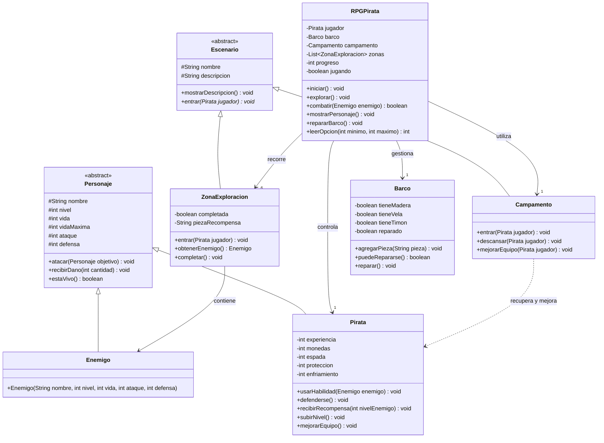

# Diagrama de clases UML — RPG Pirata

Propuesta de rediseño con herencia; no corresponde a herencias ya implementadas en el código original.

```mermaid
classDiagram
    direction TB
    class Personaje {
        <<abstract>>
        #String nombre
        #int nivel
        #int vida
        #int vidaMaxima
        #int ataque
        #int defensa
        +atacar(Personaje objetivo) void
        +recibirDano(int cantidad) void
        +estaVivo() boolean
    }
    class Pirata {
        -int experiencia
        -int monedas
        -int espada
        -int proteccion
        -int enfriamiento
        +usarHabilidad(Enemigo enemigo) void
        +defenderse() void
        +recibirRecompensa(int nivelEnemigo) void
        +subirNivel() void
        +mejorarEquipo() void
    }
    class Enemigo {
        +Enemigo(String nombre, int nivel, int vida, int ataque, int defensa)
    }
    class Escenario {
        <<abstract>>
        #String nombre
        #String descripcion
        +mostrarDescripcion() void
        +entrar(Pirata jugador) void*
    }
    class Campamento {
        +entrar(Pirata jugador) void
        +descansar(Pirata jugador) void
        +mejorarEquipo(Pirata jugador) void
    }
    class ZonaExploracion {
        -boolean completada
        -String piezaRecompensa
        +entrar(Pirata jugador) void
        +obtenerEnemigo() Enemigo
        +completar() void
    }
    class Barco {
        -boolean tieneMadera
        -boolean tieneVela
        -boolean tieneTimon
        -boolean reparado
        +agregarPieza(String pieza) void
        +puedeRepararse() boolean
        +reparar() void
    }
    class RPGPirata {
        -Pirata jugador
        -Barco barco
        -Campamento campamento
        -List~ZonaExploracion~ zonas
        -int progreso
        -boolean jugando
        +iniciar() void
        +explorar() void
        +combatir(Enemigo enemigo) boolean
        +mostrarPersonaje() void
        +repararBarco() void
        +leerOpcion(int minimo, int maximo) int
    }
    Personaje <|-- Pirata
    Personaje <|-- Enemigo
    Escenario <|-- Campamento
    Escenario <|-- ZonaExploracion
    RPGPirata --> "1" Pirata : controla
    RPGPirata --> "1" Barco : gestiona
    RPGPirata --> "1" Campamento : utiliza
    RPGPirata --> "6" ZonaExploracion : recorre
    ZonaExploracion --> "1" Enemigo : contiene
    Campamento ..> Pirata : recupera y mejora

```
